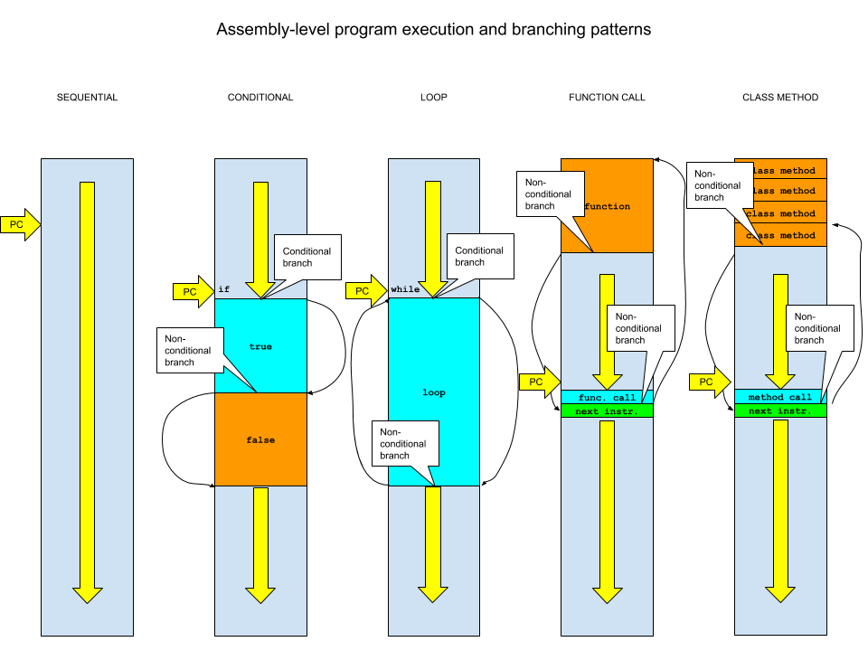

# CPE 1040

This is Learning Progression 002 of the course CPE 1040: Introduction to Computer Engineering at MSU Denver.

Table of Contents
=================

* [CPE 1040](#cpe-1040)
  * [Learning Progression 002: Bouncing Sprites](#learning-progression-002-bouncing-sprites)
    * [Step 1: Controlling the number of iterations with for](#step-1-controlling-the-number-of-iterations-with-for)
      * [1\. Study](#1-study)
      * [2\. Apply](#2-apply)
      * [3\. Present](#3-present)
    * [Step 2: Breaking out of loops with break](#step-2-breaking-out-of-loops-with-break)
      * [1\. Study](#1-study-1)
      * [2\. Apply](#2-apply-1)
      * [3\. Present](#3-present-1)
    * [Step 3: Arrays are the best use for loops](#step-3-arrays-are-the-best-use-for-loops)
      * [1\. Study](#1-study-2)
      * [2\. Apply](#2-apply-2)
      * [3\. Present](#3-present-2)
    * [Step 4: Beyond if\.\.\.else](#step-4-beyond-ifelse)
      * [1\. Study](#1-study-3)
      * [2\. Apply](#2-apply-3)
      * [3\. Present](#3-present-3)
    * [Step 5: Operators](#step-5-operators)
      * [1\. Study](#1-study-4)
      * [2\. Apply](#2-apply-4)
      * [3\. Present](#3-present-4)
    * [Step 6: Expressions](#step-6-expressions)
      * [1\. Study](#1-study-5)
      * [2\. Apply](#2-apply-5)
      * [3\. Present](#3-present-5)
    * [Step 7: Composite conditions](#step-7-composite-conditions)
      * [1\. Study](#1-study-6)
      * [2\. Apply](#2-apply-6)
      * [3\. Present](#3-present-6)
    * [Step 8: Functions and variable scope](#step-8-functions-and-variable-scope)
      * [1\. Study](#1-study-7)
      * [2\. Apply](#2-apply-7)
      * [3\. Present](#3-present-7)
    * [Step 9: Encapsulating data and functions into classes](#step-9-encapsulating-data-and-functions-into-classes)
      * [1\. Study](#1-study-8)
      * [2\. Apply](#2-apply-8)
      * [3\. Present](#3-present-8)
    * [Step 10: The separate lives of objects](#step-10-the-separate-lives-of-objects)
      * [1\. Study](#1-study-9)
      * [2\. Apply](#2-apply-9)
      * [3\. Present](#3-present-9)
    * [Step 11: Inheritance with classes](#step-11-inheritance-with-classes)
      * [1\. Study](#1-study-10)
      * [2\. Apply](#2-apply-10)
      * [3\. Present](#3-present-10)
    * [Step 12: Execution with branches](#step-12-execution-with-branches)
      * [1\. Study](#1-study-11)
      * [2\. Apply](#2-apply-11)
      * [3\. Present](#3-present-11)
  * [References and Resources](#references-and-resources)


## Learning Progression 002: Bouncing Sprites

This progression continues to introduce new programming language components, revisit those already introduced in more depth, and build up your skills to create more dynamic and compelling programs. You will get used to reading the official documentation for the JavaScript and TypeScript languages frequently as you continue learning to program.  

### Step 1: Controlling the number of iterations with `for`
[[toc](#table-of-contents)]

#### 1. Study
[[toc](#table-of-contents)]

`[<lernact-rd>]`We saw that the `while` loop is very useful for repeating behavior multiple times without having to duplicate code. But what if we wanted to repeat a behavior _exactly_ some number of times? We'll need to use a `[<cept>]`_variable_. Here's how we would go about doing this:
```javascript
// Example 1.1.1

const MAX_ITER : number = 10  // the number of iterations
let i : number = 0            // a variable to keep track of how many iterations we have done so far

while (i < MAX_ITER) {
    basic.showIcon(IconNames.Heart)
    basic.pause(100)
    basic.clearScreen()
    basic.pause(100)
    
    i = i + 1                // increment the loop variable
}
```
Several things to notice here:
1. We need to delimit the number of iterations, in this case 10, which is a `[<cept>]`_constant_.  
2. We need to keep track of how many iterations we have done so far, which is a variable, incremented each time we complete a pass through the code block.  
3. In computing, we almost always start `[<cept>]`_counting up_ from 0 and _counting down_ to 0. There are good reasons for that:  
   1. **Storage efficiency.** If we start at 0, we can represent 2 numbers with 1 bit, 0 and 1. If we started at 1, we would need 2 bits to represent the second number, which is 2<sub>10</sub> and 11<sub>2</sub>. By induction, we can represent 2<sup>n</sup><sub>10</sub> different `[<cept>]`_unsigned binary integers_ with n-1 bits, if we started at 0. Unsigned binary integers are just the `[<cept>]`_natural numbers_ (aka whole numbers) .   
   2. **Computational efficiency.** Comparison to zero can be done very quickly and efficiently in `[<cept>]`_combinatorial logic_. More on combinatorial logic in a later progression.  
   3. **Convention.** It pays to follow the convention, for example, to avoid the `[<cept>]`_off-by-one_ error, usually to do with [arrays](#step-3-arrays-are-the-best-use-for-loops).     
4. It is a widely adopted practice to give constants names in `ALL_CAPS`.  

`[<lernact-ans>]`**Question 1.1.1:** Enumerate the values of the `[<cept>]`_loop variable_ `i` takes as the `while` loop is executed.    
`[<lernact-ans>]`**Question 1.1.2:** What is the value of the loop variable _after_ the termination of the loop? _Hint: Skim the reference section on [block-scoping](https://makecode.microbit.org/javascript/variables) of variables._  
`[<lernact-ans>]`**Question 1.1.3:** Enumerate the different unsigned binary integers you can represent with 4 bits?  

What we saw in Example 1.1.1 is one of the most widely used `[<cept>]`_programming patterns_:
1. Set the maximum number of iterations. Call it, say `I`. That may or may not be a constant.  
2. Start the loop variable `i` at zero.  
3. Increment the loop variable until it reaches `I - 1`, which is equivalent to `i < I`.  
   
One thing that is deficient in controlling the number of iterations of a `while` loop like the example above is that there are bits and pieces of the necessary code all over the place. This is why programming languages almost universally provide the equivalent but much cleaner alternative syntax of the `for` loop. Let's see how we can use it to rewrite the code above and make it much cleaner:

```javascript
// Example 1.1.2

const MAX_ITER : number = 10

for (let i = 0; i < MAX_ITER; i ++) {    // the loop variable is handled automatically for us
    basic.showIcon(IconNames.Heart)
    basic.pause(100)
    basic.clearScreen()
    basic.pause(100)
}
```
The `++` in `i ++` is the `[<cept>]`_unary operator_ for `[<cept>]`_increment_. `i ++` is exactly equivalent to `i = i + 1`, and, in fact, this is a perfectly valid expression to use instead.  

The loop variable `i` takes a different value each time through the loop block, so it can be used:
```javascript
// Example 1.1.3

const MAX_ITER : number = 10

for (let i = 0; i < MAX_ITER; i ++) {         // the loop variable is handled automatically for us
    basic.showIcon(IconNames.Heart, 100 * i)  // using the loop variable to vary the icon interval
    basic.clearScreen()
    basic.pause(100)
}
```

The [for](https://developer.mozilla.org/en-US/docs/Web/JavaScript/Reference/Statements/for) loop is extremely versatile. Let's take apart its `[<cept>]`_syntax_:
```
for ([initialization]; [condition]; [final-expression])
   statement
```
The `[<cept>]`_square brackets_ `[]` indicate an _optional_ element. All three `[<cept>]`_expressions_ (more on expressions [below]((#step-6-expressions)) - the `[<cept>]`_initialization_, the `[<cept>]`_condition_, and the `[<cept>]`_final expression_ - are optional. There are various cases in which you don't want all three expressions to be included. For example, the `for (;;)` loop form is exactly equivalent to a `while (true)` loop. Note that the `[<cept>]`_expression-delimiting semi-colons_ `;` are **not optional**.

#### 2. Apply
[[toc](#table-of-contents)]

1. `[<lernact-prac>]`Write a program which, in a `for` loop from 0 to 10 (not inclusive), shows a heart icon for odd values of the loop variable `i` and a giraffe icon for even values of `i`. _Hint: You will need to use the loop variable of the `for` loop to check for odd and even numbers and have an `if...else` conditional statement in the block of the loop._  
2. `[<lernact-prac>]`Write the program shown executing on the micro:bit in this [video](https://msudenver.yuja.com/Dashboard/Permalink?authCode=754064295&b=1599792&linkType=video). It may look quite different from the examples, but it's very similar. Some hints:
   1. Use a `for` loop, of course.  
   2. To figure out what values the loop variable should take, realize that the micro:bit LED matrix has coordinates y = [0, 4] vertically from top to bottom and x = [0, 4] from left to right. So, the `[<cept>]`_origin_ (0, 0) is in the top-left corner.  
   3. Use the `led.plot()` function, utilizing the loop variable `i`. Note that you are plotting the `[<cept>]`_diagonal_.  
   4. Use `pause()` and `clearScreen`.  
3. `[<lernact-prac>]`Write a program that shows on the micro:bit 21 numbers, one after the other, starting at zero and increasing in _magnitude_, where the _even_ numbers in the interval [0, 20] are _positive_ and the _odd_ numbers in the same interval are _negative_. _Hint: Consider using a `for` loop with the `[<cept>]`_less-than-or-equal_ operator `<=` in the condition expression._  


#### 3. Present
[[toc](#table-of-contents)]

In the [programs](programs) directory:
1. Add your program from 1.2.1 with filename `microbit-program-1-2-1.js`.  
2. Add your program from 1.2.2 with filename `microbit-program-1-2-2.js`.  
3. Add your program from 1.2.3 with filename `microbit-program-1-2-3.js`.  

In the [Lab Notebook](README.md):
1. Answer question 1.1.1.  
2. Answer question 1.1.2.  
3. Answer question 1.1.3.  
4. Link to the program from 1.2.1.  
5. Link to a demo video showing the execution of the program from 1.2.1.  
6. Link to the program from 1.2.2.  
7. Link to a demo video showing the execution of the program from 1.2.2.  
8. Link to the program from 1.2.3.  
9. Link to a demo video showing the execution of the program from 1.2.3.  


### Step 2: Breaking out of loops with `break`
[[toc](#table-of-contents)]

#### 1. Study
[[toc](#table-of-contents)]

`[<lernact-rd>]`Being so useful in running the same code muliple times, the `while` and `for` loops are ubiquitous in computer programs. This is why computer languages have keywords for them. Just as often as one needs a loop, one is likely to need a way to break out it. There's a keyword for that, too, namely `break`:
```javascript
// Example 2.1.1

let stop : boolean = false
let isHeart : boolean = true

input.onButtonPressed(Button.A, () => { isHeart = !isHeart })   // "Arrow" functions are best for short code passed as argument to a function.
input.onButtonPressed(Button.B, () => { stop = true })

while (true) {
    if (isHeart)                                                 // If only one line, no block braces are required.
        basic.showIcon(IconNames.Heart)
    else
        basic.showIcon(IconNames.Butterfly)
    basic.pause(100)
    basic.clearScreen()
    basic.pause(100)
    
    if (stop)
        break
}
```
This example might look very foreign but only the `break` is new. Let's explain the syntax:
1. The event handlers for the button-press events are called `[<cept>]`_arrow functions_. This is just a shorthand for anonymous functions without arguments. This is essentially what is known as _syntactic sugar_: alternative but fully equivalent syntax adopted to save typing time. The reference has a nice short article on [functions](https://makecode.microbit.org/javascript/functions).  
2. The event handlers are each on one line instead of an extended block, but they are still in the block-delimiting curly braces `{}`.  
3. The "blocks" of the `if` statement are missing the curly braces `{}`, but this is okay as we are only executing one line of code.  This includes the `break` statement, which is semantically self-sufficient.  

In this example, when the Boolean `stop` becomes true upon the press of button B, the conditional at the bottom of the `while` loop block will be executed and program execution will jump out of the loop and never reenter. This will effectively stop the program as there is no more code left to execute after the `while` loop. This is a very simple and a bit contrived example, but the [`break`](https://developer.mozilla.org/en-US/docs/Web/JavaScript/Reference/Statements/break) keyword enables the writing of very complex program logic. 

`[<lernact-rd>]`Loops can be `[<cept>]`_nested_ (e.g. a `for` loop inside a `for` loop, or a `for` loop inside a `while` loop) any which way to achieve more complex but regular behavior. For example, the following code lights up the LEDs of the micro:bit one column at a time:
```javascript
// Example 2.1.2

let on : boolean = true

basic.forever(function () {
    for (let x = 0; x < 5; x ++) {
        for (let y = 0; y < 5; y ++) {
            if (on) 
                led.plot(x, y)
            else
                led.unplot(x, y)
            basic.pause(50)
        }
    }
    on = !on
})
```
It is important to note that a `break` only exits the _innermost_ loop, and any outer loops will continue to execute, as shown in this example:
```javascript
// Example 2.1.3

let on : boolean = true
let halfWay : boolean = false

input.onButtonPressed(Button.A, () => { halfWay = !halfWay })

basic.forever(function () {
    for (let x = 0; x < 5; x ++) {
        for (let y = 0; y < 5; y ++) {
            if (halfWay)
                if (y > 2)
                    break
            if (on) 
                led.plot(x, y)
            else
                led.unplot(x, y)
            basic.pause(50)
        }
    }
    on = !on
})
```
Notice how, when you toggle button A, the LED lighting pattern goes all the way or stops halfway. The latter case is due to the `break` statement, which cause the inner loop to exit before running through all the values of the loop variable `y`.

#### 2. Apply
[[toc](#table-of-contents)]

1. `[<lernact-prac>]`Write a program like Example 2.1.2 above, which instead fills the pattern one _row_ at a time.  
2. `[<lernact-prac>]`Write a program like Example 2.1.3 above, which instead fills in the other remaining "half" when `halfWay` is toggled true.  
3. `[<lernact-prac>]`Write a program like Example 2.1.3 above, which instead breaks on the value of the outer-loop variable `x`.  
4. `[<lernact-ans>]`Explain the behavior you observe in your program from 2.2.3.


#### 3. Present
[[toc](#table-of-contents)]

In the [programs](programs) directory:

1. Add your program from 2.2.1 with filename `microbit-program-2-2-1.js`.  
2. Add your program from 2.2.2 with filename `microbit-program-2-2-2.js`.  
3. Add your program from 2.2.3 with filename `microbit-program-2-2-3.js`.

In the [Lab Notebook](README.md):

1. Link to your program from 2.2.1.  
2. Link to a demo video for your program from 2.2.1.  
3. Link to your program from 2.2.2.  
4. Link to a demo video for your program from 2.2.2.  
5. Link to your program from 2.2.3.  
6. Link to a demo video for your program from 2.2.3.
7. Write your explanation for 2.2.4.  


### Step 3: Arrays are the best use for loops
[[toc](#table-of-contents)]

#### 1. Study
[[toc](#table-of-contents)]

`[<lernact-rd>]`Data types divide into two main groups: `[<cept>]`_primitive_ data types have `[<cept>]`_word-storage_, which means that in memory they take up a `[<cept>]`_word of memory_, usually 16 or 32 bits, while `[<cept>]`_composite_ data types have `[<cept>]`_structure-storage_, which means that they are composed of some combination of primitive-type variables. Here are examples of primitive-type variables.  
```javascript
// Example 3.1.1

let i : number = 345
let f : number = 5.602
let b : boolean = true
```

`[<lernact-rd>]`Arrays are a composite data type which is a linear sequence of elements of the **same type**, called the `[<cept>]`_base type_. The base type can be primitive or complex. Here is an example of various arrays:
```javascript
// Example 3.1.2

let iArr : number[] = [0, 1, 2]                                        // an array of integers, initialized with literal values
let fArr : number[] = [3.14, 3.142, 3.1416, 3.14159]                   // an array of floating-point numbers, also initialized with literal values
let bArr : number[] = [false, true, true, false]                       // an array of Booleans

let sArr : string[] = ["Hellow", "world", "the", "microbit", "rocks"]  // an array of strings (words of text or sequences of characters)
let twoDArr : number[][] = [[1, 3, 4], [3, 4, 5, 6, 7]]                // a 2-dimensional array, that is, an array of arrays (in this case of numbers)
let iconArr : IconNames[] = [IconNames.Heart, IconNames.Butterfly]     // an array of icons (themselves an enum type)
```
So, an array is a named variable with multiple values in a specific order. The syntax of an array variable declaration is as follows:
1. We start with the keyword `let`, followed by the variable name.  
2. We continue with the colon `:` and the base type of the array, followed by the `[<cept>]`_square brackets_ `[]`.  
3. In this example, we are initializing the arrays with values. For example, the integer array `iArr` has the values `0`, `1`, and `2`.  

An array does not have to be initialized. We can fill them later:
```javascript
// Example 3.1.3

let iArr : number[] = []                                              // an empty array of integers

iArr.push(0)                                                          // add a value at the end of the array
iArr.push(1)                                                          // add a value at the end of the array
iArr.push(2)                                                          // add a value at the end of the array
```
In memory, arrays are arranged with all the elements `[<cept>]`_contiguous_, one "on top of" the other, as in this sketch:
```
// Example 3.1.4

|-------------|
|  000000000  |           // element at index 0 has value 0 in 8-bit binary
|-------------|
|  000000001  |           // element at index 1 has value 1 in 8-bit binary
|-------------|
|  000000010  |           // element at index 2 has value 2 in 8-bit binary
|-------------|
```
This allows for array elements to be read and written based on their `[<cept>]` index. Let's see how:
```javascript
// Example 3.1.5

let fArr : number[] = []

fArr.push(3.14)
fArr.push(3.142)
fArr.push(3.1416)
fArr.push(3.14159)

let pi                 = fArr[0]        // the variable pi will have the value 3.14, taken from index 0 of the array
let piMoreAccurate     = fArr[1]        // the variable piMoreAccurate will have the value 3.142, taken from index 1 of the array
let piEvenMoreAccurate = fArr[2]        // etc.
let piVeryAccurate     = fArr[3]
```
There are many operations that can be done on arrays: add elements, remove elements, get the length, etc. The best thing to do is to check out the `Arrays` package of the Advanced section in the MakeCode menue, and, once you create an array with a name, say `myFirstArray`, type this name on a new line, and then a dot `.` to see all the available functions and properties.

`[<lernact-rd>]`Loops and arrays are often used together as the loop variable can be used as the index into the array:
```javascript
// Example 3.1.6

let favoriteIcons : IconNames[] = [IconNames.Heart, IconNames.Cow, IconNames.Diamond]

for (let i=0; i < favoriteIcons.length; i ++) {     // note the use of the length property
    basic.showIcon(favoriteIcons[i])
    basic.pause(100)
}
```
Notice how we don't need to know how many elements there are in the array to get our loop correct, because we can use the `length` property of the array type.

`[<lernact-rd>]`To iterate through a 2D array, we need 2 nested `for` loops:
```javascript
// Example 3.1.7

let twoDArr : number[][] = [[1, 3, 4], [3, 4, 5]]                 // notice that the nested arrays are all the same length

for (int x=0; x < twoDArr.length; x ++) {
    for (int y=0; y < twoDArr[0].length; y ++) {
         basic.showNumber(twoDArr[x][y])
         basic.pause(100)
    }
}
```
Let's explain this code:
1. Notice the double brackets on the array declaration `[][]`. They indicate a 2-dimensional array.  
2. The 2-dimensional array has, naturally, 2 indices. The first one (on the left) is the "outer" index, in our case, indexing the nested arrays. The second one (on the right) is the "inner" index, in our case, indexing the numbers in each nested array. That's why we have `twoDArr[x][y]`.  
3. For the second index `y`, we need to only loop through the length of the nexted arrays (assuming they are the same length, as in our case). That's why we take the length like this `twoDArr[0].length`.  

`[<lernact-rd>]`There is another way to iterate through an array, using the `forEach` function, which every array has:
```javascript
// Example 3.1.8

let favoriteIcons : IconNames[] = [IconNames.Heart, IconNames.Cow, IconNames.Diamond]

favoriteIcons.forEach(function (value: IconNames, index: number) {
    basic.showIcon(value)
    basic.pause(100)
})
```
You might recognize the function-as-an-argument paradigm that is so fundamental to JavaScript. Again, it is an anonymous function, called a `[<cept>]`_callback_ function, but notice that this time it has parameters `value` and `index`. For each element of the array, this function is called, the value of the element and its index are passed in as arguments to the callback. In our case, we only need the value, which will be an icon.  

#### 2. Apply
[[toc](#table-of-contents)]

1. `[<lernact-prac>]`Extend Example 3.1.6 to show 5 different icons and, using the loop variable `i`, show each subsequent one for a shorter period of time.  
2. `[<lernact-prac>]`Show the icons from the previous program in reverse order in two different way:
   1. By manipulating the loop variable `i` to count backwords. _Hint: What would be the corresponding unary decrement operator?_  
   2. By using the arrays's `reverse()` method.  
3. `[<lernact-prac>]`Take Example 2.1.3 and create two number arrays, `xArr` and `yArr`, where the values are the _scrambled_ (that is, not in order) column and row indices. Then, instead of plotting `x` and `y`, use the loop variables as indices into the two arrays.

#### 3. Present
[[toc](#table-of-contents)]

In the [programs](programs) directory:

1. Add your program from 3.2.1 with filename `microbit-program-3-2-1.js`.  
2. Add your program from 3.2.2.1 with filename `microbit-program-3-2-2-1.js`.  
2. Add your program from 3.2.2.2 with filename `microbit-program-3-2-2-2.js`.  
3. Add your program from 3.2.3 with filename `microbit-program-3-2-3.js`.

In the [Lab Notebook](README.md):

1. Link to your program from 3.2.1.  
2. Link to a demo video for your program from 3.2.1.  
3. Link to your program from 3.2.2.1.  
4. Link to a demo video for your program from 3.2.2.1.  
5. Link to your program from 3.2.2.2.  
6. Link to a demo video for your program from 3.2.2.2.  
7. Link to your program from 3.2.3.  
8. Link to a demo video for your program from 3.2.3.


### Step 4: Beyond `if...else`
[[toc](#table-of-contents)]

#### 1. Study
[[toc](#table-of-contents)]

`[<lernact-rd>]`Branching upon conditions is one of the most powerful features of programming languages. The basic `if...else` statement that we encountered earlier allows a `[<cept>]`_two-way branch_ in the execution of a program's code. Here we will introduce some further abilities of the statement. The first one, which we already saw in a previous step, is the `[<cept>]`_conditional one-way branch_:
```javascript
// Example 4.1.1

if (!isHeart)
    basic.showArrow(4)
```
This is essentially an `if` statement without an `else` `[<cept>]`_clause_: if the condition is false, no branching happens.

The second variety gives us the option of having more than 2 branches at the same point, by extending extending the `else` clause with its own `if` statements:
```javascript
// Example 4.1.2

let heading : number = 50    // degrees out of 360

if (heading >= 0 && heading < 22.5 || heading >= 337.5 && heading < 360) {
    basic.showArrow(ArrowNames.North)
} else if (heading >= 22.5 && heading < 67.5) {
    basic.showArrow(ArrowNames.NorthEast)
} else if (heading >= 67.5 && heading < 112.5) {
    basic.showArrow(ArrowNames.East)
} else if (heading >= 112.5 && heading < 157.5) {
    basic.showArrow(ArrowNames.SouthEast)
} else if (heading >= 157.5 && heading < 202.5) {
    basic.showArrow(ArrowNames.South)
} else if (heading >= 202.5 && heading < 247.5) {
    basic.showArrow(ArrowNames.SouthWest)
} else if (heading >= 247.5 && heading < 292.5) {
    basic.showArrow(ArrowNames.West)
} else {
    basic.showArrow(ArrowNames.NorthWest)
}
```
This is called an `if...else` cascade and the conditions are `[<cept>]`_composite conditions_ (more on [them](#step-7-composite-conditions) later). The most important thing to notice is that, as we descend down the cascade, all the conditions that weren't true accumulate and so there is an increasingly narrow region remaining for the rest of the cases. Sometimes, if we are not paying attention to this narrowing region, we can write a cascade in a way that some of the conditions _will never be true_. Let's illustrate with an example:
```javascript
// Example 4.1.3

let x : number

if (x % 2 == 0) {     // if x is even
   // do something
} else if (x == 40) { // if x is equal to 40
   // do another thing
} else {
   // yet another thing
}
```
Obviously, if the number is not even, it cannot be 40. If we wanted to test for equality to 40, we should have either nested the test under the even numbers, like:
```javascript
// Example 4.1.4

let x : number

if (x % 2 == 0) {     // if x is even
   if (x == 40) {     // if x is equal to 40
       // do something very specific
   } else {
       // do another thing for all other even numbers
   }
} else {
   // do something for the odd numbers
}
```
or should have started with the specific test, like:
```javascript
// Example 4.1.5

let x : number

if (x == 40) {                     // if x is equal to 40
   // do something very specific
} else if (x % 2 == 0) {           // if x is even (but not 40)
   // do another thing for all other even numbers
} else {                           // x is odd
   // do something for the odd numbers
}
```
In general, the cases one level down the cascade should be further specifications of the case that was taken in the branch on the level above.

Looking at the syntax of the [if...else](https://developer.mozilla.org/en-US/docs/Web/JavaScript/Reference/Statements/if...else) statement in the JavaScript documentation, we see all the cases we have seen so far.

`[<lernact-rd>]`We have seen that `if...else` cascades, for all their power, can be quite error-prone and hard to read (and, so, fix if erroneous). There is another statement that can be used instead, namely the `switch` statement. Here is an example:
```javascript
// Example 4.1.6

let speedLimit : number = 65
let speed : number 

switch (speedLimit) {
    case 25:
        speed = 30
        break
    case 35:
        speed = 45
        break
    case 45:
        speed = 60
        break
    case 55:
        speed = 75
        break
    default:
        speed = 85
}

basic.forever(function () {
    basic.showNumber(speed)  
})
```
Notice two important points:
1. Each `case` should have a `break` to jump out of the `switch` statement, unless we intentionally want to _fall through_ and do the same thing for more than one case.  
2. The `default` clause is a `[<cept>]`_catch-all_, just like the final `else` in an `if...else` cascade.   

Let's take a look at syntax for the `switch` statement:
```
// Example 4.1.7

switch (expression) {
  case value1:
    //Statements executed when the
    //result of expression matches value1
    [break;]
  case value2:
    //Statements executed when the
    //result of expression matches value2
    [break;]
  ...
  case valueN:
    //Statements executed when the
    //result of expression matches valueN
    [break;]
  [default:
    //Statements executed when none of
    //the values match the value of the expression
    [break;]]
}
```
Notice in the [documentation](https://developer.mozilla.org/en-US/docs/Web/JavaScript/Reference/Statements/switch) how all `case` clauses as well as the `default` clause are all _optional_.

In general, `switch` statements are best for numerical equalities and `if...else` cascades are best for `[<cept>]`_intervals_ and `[<cept>]`_inequalities_, as we saw in Example 4.1.2.  

#### 2. Apply
[[toc](#table-of-contents)]

1. `[<lernact-prac>]`The `enum` type `IconNames` contains 40 icon names. These names actually resolve to numbers. You can easily see that with these lines:
   ```javascript
   // Example 4.1.8
   
   basic.showNumber(IconNames.Heart)
   basic.showIcon(39)
   ```
   So, the first one, at index 0, is `IconNames.Heart`, and the last one, at index 39, is... I have no idea :-o. Anyway, write a program that shows only _odd_ icons.  
2. `[<lernact-prac>]`Cycle through the icons and show the ones in the index range 0-9 for 100 ms, 10-19 for 200 ms, etc., that is, for a time proportional to the decade of their index.  
3. `[<lernact-prac>]`**TODO (ivogeorg, 2021-02-27): Too contrived. Redo.** Cycle through the icons and, using a `switch` statement, show them as many times as the `[<cept>]`_remainder_ of their index divided by 7. The `[<cept>]`_modulo_ operator `%` will come useful. The expression `x % y` gives you the remainder of the division of `x` by `y`.      
4. `[<lernact-prac>]`**[Optional challenge, max 3 extra step points]** Cycle through the icons and, using a `switch` statement, show them as many times as the smallest odd `[<cept>]`_divisor_ of their index (3 times if divisible by 3, 5 if divisible by 5 but not by 3, etc.), 2 times if the index is even, and only once if their index is `[<cept>]`_prime_. Hints and notes:
   1. It is natural to use a `for` loop to cycle through the icons (as natural numbers).  
   2. For the `switch` expression, consider using the `[<cept>]`_division_ operator `/` and the function `Math.floor()`.    
   3. Think of what it means for one number to be divisible (aka exactly divisible) by another.  
   4. The `case` statements are checked one at a time, from top to bottom, but they can be written in any order. Think of how you can arrange them cleverly to help with the solution.  

#### 3. Present
[[toc](#table-of-contents)]

In the [programs](programs) directory:

1. Add your program from 4.2.1 with filename `microbit-program-4-2-1.js`.  
2. Add your program from 4.2.2 with filename `microbit-program-4-2-2.js`.  
3. Add your program from 4.2.3 with filename `microbit-program-4-2-3.js`.
3. Add your program from 4.2.4 with filename `microbit-program-4-2-4.js`.

In the [Lab Notebook](README.md):

1. Link to your program from 4.2.1.  
2. Link to a demo video for your program from 4.2.1.  
3. Link to your program from 4.2.2.  
4. Link to a demo video for your program from 4.2.2.  
5. Link to your program from 4.2.3.  
6. Link to a demo video for your program from 4.2.3.
7. Link to your program from 4.2.4.  
8. Link to a demo video for your program from 4.2.4.


### Step 5: Operators
[[toc](#table-of-contents)]

#### 1. Study
[[toc](#table-of-contents)]

`[<lernact-rd>]`We have seen manu `[<cept>]`_operators_ so far. In programming languages and mathematics, operators are symbols which stand for specific _actions_ the computer to make. These can be mathematical functions (like the arithmetic functions) but don't have to be. For example, the dot, or `[<cept>]`_dereferencing_ or `[<cept>]`_member access_, operator `.` serves to select, for example, a specific sub-entity (that is, member) in a package, variable, or type. Operators are usually a single character, but they don't have to be. For example, the increment operator `++` and the corresponding decrement operator `--` are two-character strings. We'll call out several familiar operators to strengthen the awareness about their usage:

**Arithmetic.** The `+`, `-`, `*`, and `/` operators for addition, subtraction, multiplication, and division, are the same as familar to everyone. The double-star `**` stands for the `[<cept>]`_power_ operator. For example, `10**2` equals `100`. All of these operators are `[<cept>]`_binary_, which here means that they have two `[<cept>]`_operands_. For example, in the expression `x + y`, the variables `x` and `y` are called operands. They are what the operator operates on. However, the increment `++` and decrement `--` operators are `[<cept>]`_unary_, as we have see in the expression `i ++` for the loop variable `i`. The `+` and `-` also have a unary intepretation when we refer to positive and negative numbers like `+2.01` and `-3.14`. While the `+` is the default and can be omitted, the `-` cannot!  

**Concatenation.** The `+` operator is `[<cept>]`_overloaded_ (meaning re-used with a special meaning for a particular data type other than numeric) to represent `[<cept>]`_concatenation_ of strings. For example:
```javascript
// Example 5.1.1

basic.showString("Hellow, " + "world!")     // which is equivalent to the next line
basic.showString("Hellow, world!")
```
and
```javascript
// Example 5.1.2

let name : string = "Danny"

basic.showString("Hellow, " + name + "!")     // which is equivalent to the next line
basic.showString("Hellow, Danny!")
```

**Assignment.** The assignment operator `=` takes the value of the expression on its right and writes it to the variable on its left, as in `i = 10` and, when it is combined with a variable declaration, `let i = 0`. Both variables and constants can be assigned, though variables can be re-assigned many times, while constants can be assigned only once, usually when they are declared.

**Equality.** The equality operator `==` compares the _values_ of the expressions or variables on both sides for equality. They are most often used in _conditional_ statements, for example in `if (icon == IconNames.Heart) { ... }`. A condition like `icon == IconNames.Heart` yields are true-of-false value. Think of conditions as asking a _yes-or-no question_, in this case _Is the value of the variable `icon` equal to the number represented by the name `IconNames.Heart`?_. Then, you will intuitively think of the answer as yes (`true`) or no (`false`). A side note on the use of Boolean variables in conditions: since they are already condition-valued, that is, they have the value of `true` or `false`, they do not need to be compared with `==`. For example, we have seen the `isHeart` Boolean variable used in a condition on its own, like `if (isHeart) { ... }`. Notice how its very name asks a yes-or-no question. (Of course, that depends on you, the programmer! :))  

The operator which tests for **in**equality is `!=`, where `!` means "not". Note that there is no operator `!==`!

**Assignment vs equality.** One of the most prevalent errors in programming is the confusion between `=` (assignment) and `==` (test for equality). Endless programmer hours have been wasted on hunting for this bug, especially because the programming languages do not forbit the usage of `=` in conditions. For example, in `if (i = 5) { ... }`, where supposedly we wanted to test if `i` equals `5`, we are actually assigning `5` to `i` and the value that is tested is the `[<cept>]`_automatically conveted_ value of the variable `i`, which is `false` if `i` happens to be equal to `0`, and `true` otherwise (that is, non-zero).

**Relational.** These are the usual (partial) inequality operators `<` (less than), `>` (more than), `<=` (less than or equal), and `>=` (more than or equal), which can most often be found in condition expressions, like `x < 5`, `y > z`, `i <= MAX_ITERATIONS`, etc. These also yield true-or-false values. Note that the expressions are read and interpreted **from left to right**. Also, note that there are no operators `=<` or `=>`!   

**Precedence.** `[<cept>]`_Operator precedence_ is a set of rules to resolve any (possibly ambiguous at first glance) expression involving more than one operator. For example, in the expression `i**2 + 6`, `i` will be first raised to power of `2` and only then `6` will be added to the result. [Precedence](https://developer.mozilla.org/en-US/docs/Web/JavaScript/Reference/Operators/Operator_Precedence) eliminates all ambiguity, but that doesn't mean that the expression the programmer wrote will be evaluated the way the programmer intended (unless they are fully knowledgeable about the `[<cept>]`_order of precedence_). So, whenever you are in doubt, use parentheses `()` around sub-expressions. For example, the parentheses in `(a * b) + c` are redundant, but give you extra certainty about the result.

**Logical.** You have already seen all the logical operators:
1. Operator `!` (logical NOT), when flipping the Boolean `isHeart`.  
2. Operator `&&` (logical AND) in the compass `if...else` cascade example.  
2. Operator `||` (logical OR) in the compass `if...else` cascade example.  

These operators represent `[<cept>]`_logical functions_. Because we are referring to Boolean logic here, they are also known as Boolean functions. As a reminder, Boolean logic is 2-valued, and the values are represented by either `0` and `1` or, correpsondingly, `false` and `true`.

The logical operators are used to link together condition expressions into _composite_ condition expressions. Back in the compass example, we used `&&` and `||` to define the interval for each world-direction arrow (N, NE, E, SE, S, SW, W, and NW):
```javascript
// Example 5.1.3

if (heading >= 0 && heading < 22.5 || heading >= 337.5 && heading < 360) {
    basic.showArrow(ArrowNames.North)
} else if (heading >= 22.5 && heading < 67.5) {
    basic.showArrow(ArrowNames.NorthEast)

// more of the cascade here    

} else {
    basic.showArrow(ArrowNames.NorthWest)
}
```
Note two things:
1. NOT is `[<cept>]`_right-associative_, which means it attaches to the expression or variable **on its right**. We saw this in when flipping the Boolean `isHeart = ! isHeart`.   
2. The precedence of these operators, from higher to lower, is NOT -> AND -> OR. This means, for example that we didn't have to use parentheses around the `&&` expressions in the expression `heading >= 0 && heading < 22.5 || heading >= 337.5 && heading < 360` to define the interval in degrees for North (`ArrowNames.North`).  

The Boolean functions AND, OR, and NOT, fundamental to computing and used at every level, from high-level programming to `[<cept>]`_logic gates_, can best be expressed with tables, called `[<cept>]`_truth tables_, as follows:
Expression 1 (A) | Expression 2 (B) | Composite expression (A AND B)
--- | --- | ---
false | false | false
false | true | false
true | false | false
true | true | true

A | B | A OR B
--- | --- | ---
false | false | false
false | true | true
true | false | true
true | true | true

A | NOT A
--- | ---
true | false
false | true

So, AND requires both expressions to be true to turn up true, OR reqiures at least one expression to be true to turn up true, and NOT flips the value.   

**Member selection.** The two member-selector operators we have encountered are the dot `.` and the indexing square brackes for arrays `[]`. The latter is known as the `[<cept>]`_computer member access_, because the element index is used to calculate its offset in memory relative to the first element, where the array name points. For an array, both of these operators can be used, as we have seen in `for` loops. For example:
```javascript
// Example 5.1.4

let arr : number[] = [13, 17, 19]

for (let i=0; i<arr.length; i++) {
    basic.showString("arr" + arr[i].toString())
}
```

#### 2. Apply
[[toc](#table-of-contents)]

1. `[<lernact-prac>]`Write a program that scrolls a string along the LED matrix of the micro:bit, in a `for` loop. Each time through the loop, the loop variable `i` should be concatenated to the string before its shown. Note that `+` will not work on a string and a number, like `"hello" + 6`, so `i` needs to be converted to a string `"i"` by calling its `toString()` method. Remember how we added to a variable, like `i = i + 3`; you have to do something similar with your string variable.  
2. `[<lernact-prac>]`Write a progam that adds elements to an array, in a `for` loop. Start with the array `[1, 1, 1, 1, 2, 2, 2, 2]`. Each time through the loop, using the array function `insertAt()`, add the loop variable to the array in such a way that the result will be `[1, 1, 1, 1, 0, 1, 2, 3, 4, 5, 2, 2, 2, 2]`. Then, in another `for` loop, print the array in the following way: `"12"`, `"12"`, ..., `"05"`, `"14"`, ... . In other words, the first time through the loop, you should take the first and last elements, convert them to strings, concatenate them, and print them with `showString()`, continuing inward from both ends as the loop continues. Hints and notes:
   1. What is the number of iterations for the first loop?  
   2. What is the number of iterations for the second loop?  
   3. You will need to use the `length` property on the array. Note that, if you are changing the array in the loop, the `length` value will be changing, too.   
   4. When you want to index the elements on the right, those that are close to the end of the array, consider and run this code example:
      ```javascript
      // Example 5.1.5
      
      let arr: number[] = [1, 4, 6]
      basic.showNumber(arr[arr.length-1])
      ```

#### 3. Present
[[toc](#table-of-contents)]

In the [programs](programs) directory:

1. Add your program from 5.2.1 with filename `microbit-program-5-2-1.js`.  
2. Add your program from 5.2.2 with filename `microbit-program-5-2-2.js`.  

In the [Lab Notebook](README.md):

1. Link to your program from 5.2.1.  
2. Link to a demo video for your program from 5.2.1.  
3. Link to your program from 5.2.2.  
4. Link to a demo video for your program from 5.2.2.  


### Step 6: Expressions
[[toc](#table-of-contents)]

#### 1. Study
[[toc](#table-of-contents)]

`[<lernact-rd>]`We have mentioned "expressions" many times already, but have not defined what they are. [Wikipedia](https://en.wikipedia.org/wiki/Expression_(computer_science)) provides a very compact and precise definition: _In computer science, an expression is a syntactic entity in a programming language that may be evaluated to determine its value._ So, in plain words, expressions are piece of program code which can be `[<cept>]`_evaluated_, using the syntactic rules of the language and the values of the variables and constants that appear in the expressions. Going back to our initial definition of computers, expressions are in the heart of the data manipulation that computers do.

Expressions can appear as operations on constants and variables defined by operators. They can also be single keywords. Most importantly, they are very often composite, in the sense that there is a hierarchy of evaluation that needs to be applied, based on operator precedence, before the final value can be determined. As we know, computers only work on numbers, so the value of every expression is numerical.

Expressions can appear in many places: on the right side of assignments, on both sides of relational and equality operators, in conditions, as arguments to functions, etc.
```javascript
// Example 6.1.1

let z = 2 * length + 4 * width                                         // height and width are variables with their own values

if (z != 0 && z > 5 * (outer_dimension + 2 * inner_dimension)) {       // outer_dimension and inner_dimension are variables or constants
    model.updateHeight(z, z + 1, 2 * z + 4, epsilon)                   // updateHeight is a function, and epsilon is a variable or constant
}
```

Another term that appears often when expressions are discussed is `[<cept>]`_statement_. There isn't a definition of statement (in the computer programming sense of the word) as crips as that for expressions, but a statement can be thought of as a directive to the computer to perform an action. Even that is too vague, so the best thing to do is to see the exhaustive lists of [JavaScript statements](https://developer.mozilla.org/en-US/docs/Web/JavaScript/Reference/Statements) and [micro:bit TypeScript statements](https://makecode.microbit.org/javascript/statements). Many of them are already familar to you from previous steps.  


#### 2. Apply
[[toc](#table-of-contents)]

1. `[<lernact-prac>]`Write the following program:
   1. In a loop, generate random points (x, y) for the LED matrix. So, x and y are both between 0 and 4. 
   2. The loop stops with the first pair of points which have one _same_ and one _different_ coordinate. These points are going to lie either on the same row (y-s are equal) or on the same column (x-s are equal).
   3. Light up these two points. They define a horizontal or vertical line.
   4. In a loop of 100 or more iterations, generate random points and only light them up if:
      1. If the line is horizontal, the points lie strictly below it.
      2. If the line is vertical, the points lie strictly to the right of it.
   5. This should result in all points on the correct side being lit up.
   6. Repeat from the beginning.
2. `[<lernact-prac>]`**[Optional challenge, max 3 extra step points]** Write a program which:
   1. Picks and lights two random points on the micro:bit LED matrix.  
   2. Then, in a loop, starts generating random points one by one.  
   3. Each generated point is compared to the line defined by the points in (1), and, if it is **below and/or to the right of the line**, it is lit up.  
   4. Runs until the region below and/or to the right of the line is filled up.  
3. `[<lernact-prac>]`**[Optional challenge, max 3 extra step points]** Write a program which:
   1. Picks and lights two random points on the micro:bit LED matrix.  
   2. Lights that line. Note that due to the low resolution, it will be heavily `[<cept>]`_aliased_ and crude. You will need to pick which LED positions belong to the line mathematically.  
   3. Draws a second line which is `[<cept>]`_orthogonal_ to the first one, and most closely _bisects_ it.  
   4. On pressing button A, two new points are picked and the above procedure is repeated.  

#### 3. Present
[[toc](#table-of-contents)]

In the [programs](programs) directory:

1. Add your program from 6.2.1 with filename `microbit-program-6-2-1.js`.  
2. Add your program from 6.2.2 with filename `microbit-program-6-2-2.js`.  
3. Add your program from 6.2.3 with filename `microbit-program-6-2-3.js`.  

In the [Lab Notebook](README.md):

1. Link to your program from 6.2.1.  
2. Link to a demo video for your program from 6.2.1.  
3. Link to your program from 6.2.2.  
4. Link to a demo video for your program from 6.2.2.  
5. Link to your program from 6.2.3.  
6. Link to a demo video for your program from 6.2.3.  


### Step 7: Composite conditions
[[toc](#table-of-contents)]

#### 1. Study
[[toc](#table-of-contents)]

`[<lernact-rd>]`We have seen everything that we need to use _composite conditions_ in conditional statements, to get exactly the complex behavior we want from our programs. Let's recap:
1. Even though only `if...else` can properly be called a _conditional statement_, the `while` and `for` loop statements also include _conditions_.   
2. Conditions are _expressions_ which evaluate to the Boolean `true` or `false`. Boolean variables are the simplest conditions.  
3. `true`-`false` expressions can be combined with the Boolean logic operators `&&` (AND), `||` (OR), and `1` (NOT).  

**[TODO, ivogeorg, 2021-03-19]:** This needs a walkthrough and a variety of examples. As an advanced aside, explain Boolean algebra, esp. the equivalence of `!(a &&b)` and `!a||!b`.  

#### 2. Apply
[[toc](#table-of-contents)]

The following exercises can be written in more than one way, but you are encouraged to try your hand at solutions involving composite conditions.

1. `[<lernact-prac>]`Using `led.plot()`, blink a 3x3 square in the middle of the 5x5 LED matrix. At the press of a button A, toggle between "solid" and "hollow" square.  
2. `[<lernact-prac>]`Using `led.plot()`, blink a 3x3 square along the top-left botton-right diagonal. At the press of a button A, toggle between "solid" and "hollow" square.  
3. `[<lernact-prac>]`Using `led.plot()`, blink a 3x3 square clockwise and counterclockwise in the corners of the 5x5 LED matrix. At the press of a button A, toggle between "solid" and "hollow" square. At the press of button B, toggle the clockwise-counterclockwise direction.   

#### 3. Present
[[toc](#table-of-contents)]

In the [programs](programs) directory:

1. Add your program from 7.2.1 with filename `microbit-program-7-2-1.js`.  
2. Add your program from 7.2.2 with filename `microbit-program-7-2-2.js`.  
3. Add your program from 7.2.3 with filename `microbit-program-7-2-3.js`.

In the [Lab Notebook](README.md):

1. Link to your program from 7.2.1.  
2. Link to a demo video for your program from 7.2.1.  
3. Link to your program from 7.2.2.  
4. Link to a demo video for your program from 7.2.2.  
5. Link to your program from 7.2.3.  
6. Link to a demo video for your program from 7.2.3.


### Step 8: Functions and variable scope
[[toc](#table-of-contents)]

#### 1. Study
[[toc](#table-of-contents)]

`[<lernact-rd>]`Blocks, that is, lines of code enclosed in curly braces `{}`, not only encapsulate code, but also define `[<cept>]`_scope_ for variables and functions. The scope of a variable of function is the region of code where it is defined and accessible. Variables and functions defined in a block are defined and visible to all the code inside the block, including any _nested_ blocks, but **not** outside the block where they are defined. This is called `[<cept>]`_block scoping_ and is an important feature of programming languages that allows well-organized and modular programs. Let's revisit the various block scopes that we have encountered so far:
```javascript
// Example 8.1.1

{
    let fairyTale : string = "once upon a time..."

    basic.showString(fairyTale)
    basic.pause(100)

    fairlyTale = "there lived dragons"

    basic.showString(fairyTale)
    basic.pause(100)
}
```
This is just a standalone block that does not change the way the lines of code inside are executed, but still performs its scoping function. This kind of block is rarely encountered as it is effectively equivalent to the `[<cept>]`_global scope_, the highest "block" in the nesting hierarchy. Variables declared at this level are called, naturally, `[<cept>]`_global variables_. We have used them a number of times so far.

Loops and conditional statements come with blocks whenever there is more than one line of code to encapsulate:
```javascript
// Example 8.1.2

// here be global scope!

const LED_SIDE : number = 5
let onOff : boolean = true

while (! stop) {
    for (let i=0; i < LED_SIDE; i++) {
        if (i >= 1 && i <= 3) {
            let x = i
            let y = i
            if (onOff) {
                led.plot(x, y)               // this scope is 4 levels deep relative to global
            } else {
                led.unplot(x, y)
            }    
        }
    }
    onOff = ! onOff
}
```
Loops and conditional statements are very frequently nested within one another, creating a complex block scoping hierarchy. A good rule of thumb is to declare variables as close as possible to the code that will use them. This allows the programmer to focus on a narrow part of the hierarchy (containing block and contained block) around the variable and get the scoping correct. In the example above:
1. The variable `onOff` has to be declared in the global scope because it's used in the lower `while`-loop scope.   
2. The loop variable `i` is scoped within the `for` loop and not "visible" to the `while`-loop scope.  
3. The (admittedly unnecessary) variables `x` and `y` are declared in the `if` statement and are not visible to the `for`-loop scope.  

Functions can be thought of as _named scopes_ with the additional capabilities to receive and return data.
```javascript
// Example 8.1.3

function neighbors(x : number, y : number, on : boolean) : void {
    for (let i = -1; i < 2; i ++) {
        for (let j = -1; j < 2; j ++) {
            if (i != x && j != y) {
               if (on) 
                  led.plot(i, j)
               else
                  led.unplot(i, j)
            }
        }
    }
}

neighbors(3, 4, true)
```
Let's take this example apart:
1. We are declaring a function called `neighbors` to either turn on or off the neighboring LEDs around a point in the LED matrix.  
2. The function takes 3 `[<cept>]`_parameters_: `x` and `y` are coordinates, and `on` is a Boolean indicating if neighbors should be turn on or off.  
3. The function does not return anything, hense the `void` type after the arguments. This is the default, so it can be omitted.  
4. What are the variables that are _within scope_ of the function:   
   1. `x`, `y`, and `on` reside in the top scope of the function. That's why we can use them inside all the nested blocks. We can use them absolutely the same way we use variables declared in the top scope of the function, which called `[<cept>]`_local variables_. The only difference is that their values when the function is called are copies of the arguments the function was called with (see (5) below and the next paragraph).          
   2. `i` resides in the scope of the outer `for` loop and is only used in its block.   
   3. `j` resides in the scope of the inner `for` loop and is only used in its block.  
5. The function is called with the `[<cept>]`_arguments_ `3` (for the `x` parameter), `4` (for the `y` parameter), and `true` (for the `on` parameter).

We know we can call the `neighbors` function not only with literal values (here `3`, `4`, and `true`), but also with variables. Let's take a look:
```javascript
// Example 8.1.4

let col : number
let row : number

// some code assigns the variables col and row

neighbors(col, row, col >= row)
```
What happens to the values of `col` and `row` when they are used as arguments to a function? Nothing: the function receives _copies_ of their values and, even if it tries to change them like, say `x ++` in its `[<cept>]`_body_ (another synonym for the function block and top scope), the original value of `col` will not be affected. This is called call `[<cept>]`_by value_, because only the values of the variables were used in the arguments to the function, not the variables themselves (meaning the memory locations where they are stored).

Something differet happens with arrays, which as we remember, are _composite types_. The name of the array stands for all the elements it has. And, since the array can have an arbitrary number of elements, its elements cannot all be passed in as arguments to a function, nor, conversely, be retuned from a function, the array is passed into and out of functions `[<cept>]`_by reference_ (meaning the memory address is passed in as an argument to a fucntion or returned from a function), allowing the function to work on the _original_ elements and change their values _in place_. Here's an example (run to convince yourself):
```javascript
// Example 8.1.5

let arr : number[] = [1, 2, 3]

function double(a : number[]) {
    for (let i = 0; i < arr.length; i ++)
        a[i] *= 2
}

double(arr)     // arr is passed by reference and the function modifies the original array

arr.forEach(function (value: number, index: number) {
    basic.showNumber(value)    
})
```

`[<lernact-rd>]`We will briefly mention here that functions **can** be declared _inside_ other functions. In this case, they cannot be called outside of the declaring scope unless they are returned out of the function and assigned to a function-valued variable outside it. As a reminder, in JavaScript (and TypeScript, being a superset of JS), functions are `[<cept>]`_first-class citizens_, so anything that can be done with variables in the language is also permitted to be done with functions. This said, it is unlikely that we'll need to use these advanced function features.  

#### 2. Apply
[[toc](#table-of-contents)]

1. `[<lernact-prac>]`If you needed to print out (aka show) a bunch of strings, one after the other, with commas between all of them, but without a trailing comma (that is, like `I, cannot, believe, my, eyes`), how would you do it? You have the array `["I", "cannot", "believe", "my", "eyes"]`. Use a `for` loop to print the show the strings. _Hint: There are two ways to do it:_
   1. _One with a check (that is, condition) on the loop variable which is used as the array index. This one is expensive, as the check has to be performed for each value of the loop variable, and for a large array that is considerable overhead._  
   2. _One with a clever initialization of the loop variable. This one is much cheaper computationally, but it does have a line of redundant code._   
2. `[<lernact-prac>]`Using the technique from program 8.2.1.2, write a program which:
   1. Runs a `for` loop. It doesn't have to do anything, but it's up to you.
   2. In the `for` loop, there is a conditional `break`, based on a random Boolean (remember the function).  
   3. After the loop terminates, it reports how many iterations were made and whether it terminated naturally or was broken out of. _Hint: How would the number of iterations tell you which one was which termination?_ 
3. `[<lernact-prac>]`**[Optional challenge, max 3 extra step points]** In this exercise, we'll motivate _classes_, the topic of the next three steps, so, please follow the instructions and _do not use the built-in array methods_. You have the array of numbers `[5, 9, 17]`. Write:
   1. A function that returns the length of the array. _Hint: Take a look at what MakeCode does when you try to get an element of the array past the last element, and consider using the function `isNan()`.  
   2. A function which appends (that is, adds at the end, aka `push`) an element. _Hint: You will need to copy the values of this array to a larger array._  
   3. A function which removes an element from the end (aka `pop`). _Hint: You will need to copy the values of this array to a smaller array._  
   4. Using these functions, arrive at the array `[5, 9, 16, 19, 30]` and print the numbers one after the other.  

#### 3. Present
[[toc](#table-of-contents)]

In the [programs](programs) directory:

1. Add your program from 8.2.1.1 with filename `microbit-program-8-2-1-1.js`.  
2. Add your program from 8.2.1.2 with filename `microbit-program-8-2-1-2.js`.  
3. Add your program from 8.2.2 with filename `microbit-program-8-2-2.js`.  
4. Add your program from 8.2.3 with filename `microbit-program-8-2-3.js`.

In the [Lab Notebook](README.md):

1. Link to your program from 8.2.1.1.  
2. Link to a demo video for your program from 8.2.1.1.  
3. Link to your program from 8.2.1.2.  
4. Link to a demo video for your program from 8.2.1.2.  
5. Link to your program from 8.2.2.  
6. Link to a demo video for your program from 8.2.2.  
7. Link to your program from 8.2.3.  
8. Link to a demo video for your program from 8.2.3.


### Step 9: Encapsulating data and functions into classes
[[toc](#table-of-contents)]

#### 1. Study
[[toc](#table-of-contents)]

`[<lernact-rd>]`When a program becomes big, and multiple functions modify the values of multiple variables, programming becomes hard and `[<cept>]`_debugging_ (meaning locating and removing logical errors from the program) becomes even harder. This was actually such a big problem in early computing that it brought about the introduction of one of the most powerful programming paradigms, `[<cept>]`_object-oriented programming_. Objects are `[<cept>]`_user-defined composite types_, which encapsulate data along with the `[<cept>]`_methods_ (that is, functions) that can be executed against them. Objects are defined by `[<cept>]`_classes_, which are essentially _object templates_ or _object blueprints_. In other words, objects are `[<cept>]`_instances_ of [classes](https://makecode.microbit.org/javascript/classes). With this powerful programming language construct, we don't need to pass data around to various functions, trying to keep the data updated at all times. The object-oriented paradigm turns this around: now we create objects which encapsulate this data and call their methods to manipulate the data; all the bookkeeping is taken care of for us.

Let's jump right in with an example of a simple class, called `Point`:
```javascript
// Example 9.1.1

class Point {
    x : number
    y : number 
    
    constructor(x : number, y : number) {
        this.x = x
        this.y = y
    }
    
    move(x_offset : number, y_offset : number) : void {
        this.x = this.x + x_offset
        this.y = this.y + y_offset
    }
    
    to_origin() : void {
        this.x = 0
        this.y = 0
    }
}
```
Let's take this apart component by component:
1. The class is declared starting with the keyword `class`.  
2. The class is given a name, in our case `Point`.  
3. The class declares what internal data its instances (that is, the objects of this class). In this case, they are the coordinates `x` and `y`. Internal object data are also called `[<cept>]`_fields_.     
4. To create instances, the class needs to define a `[<cept>]`_constructor_, a special function that is called once and only once at the declaration of an object variable of this class. This function has the same syntax in all classes, namely `constructor() { ... }`, of course, including parameters between the parentheses.    
5. The class also defines other `[<cept>]`_methods_ (that is, functions) that the objects can execute (essentially, on themselves) to change their internal data as they move around the program. Notice that we don't use the keyword `function`. This is understood when we type a name with parentheses afterwards, like `my_method(param1, param2) { ... }`!    
6. These particular methods do not return anything, hence the `: void` at the end of their signatures.  
7. The class, as usual, defines a scope between its curly braces `{}`.  

Classes are `[<cept>]`_user-defined data types_. Just like built-in primitive types like `number`, which can participate in arithmetic expressions, and built-in composite types like `string`, which have methods for manipulating their characters, user-defined classes have some data and some operations that are allowed on these data. Just like variables of type `number` or `string` can be declared, so can variables of any user-defined type (aka class) be declared. Let's see this:
```javascript
// Example 9.1.2

let p : Point = new Point(2, 1)      // this is where the constructor is called, with the two arguments

p.move(2, 0)
p.to_origin()

led.plot(p.x, p.y)                   // the internal data can be accessed and used, unless specifically forbidden (we'll see how later)
```
We see that variable declaration is the same as for built-in types to the left of the assignment, with the class name being the data type. To the right of the assignment, we use the `new` keyword and call the constructor, with any necessary arguments, by specifying the class name, as if it were a function. (In fact, it is a function, namely, the constructor.)  

We also see that the selector operator `.` works just like for built-in composite types like `string` and array. In fact, `string` is internally declared as a class in JavaScript. MakeCode has several classes that are specific to the micro:bit, the one that we are prodominantly going to work with being the `game.LedSprite`, which is just a lit LED that can move around, go brighter or dimmer, bounce off the "walls", etc.


#### 2. Apply
[[toc](#table-of-contents)]

1. `[<lernact-prac>]`Create a class `BrightPoint`, like `Point` in the example, which also has a numerical `brightness` variable. The brightness of LEDs take values from 0 to 255. Create a few `BrightPoint`s at different locations and with different brightness, and use `led.plotBrightness()` to light them up on the micro:bit LED matrix. _Hint: Remember to add the brightness parameter to the constructor._    
2. `[<lernact-prac>]`Create a class `RandomSquare` with random side (1, 2, or 3) that can be plotted on the LED matrix. Write a small program to have squares appear on the LED matrix and fade. _Hint: Fading is a gradual decrease in brightness until it reaches 0._   
3. `[<lernact-prac>]`**[Optional challenge, max 3 extra step points]** Write a class `Slytherin`, which represents a snake with length between 2 and 5, which moves slowly in a straight line, from left to right or right to left. Also:
   1. There should be only one snake at any point. No new snake should appear until the previous one has slid off the LED matrix.  
   2. The side and height of appearance of the snake should be randomized.   
   3. On press of button A, the snake should **move one position up**, and then immediately turn back to its directio of motion.  
   4. On press of button B, the snake should **move one position down**, and then immediately turn back to its directio of motion. See the sketch of a snake of lenth 3, moving from left to right, starting in the middle:
      ```
      °°°°°   °°°°°   °°°°°   °°°°°           °°°°°   °°°°°   °°°°°   °°°°°   °°°°°   °°°°°
      °°°°°   °°°°°   °°°°°   °°°°°           °°s°°   °°ss°   °°sss   °°°ss   °°°°s   °°°°°
      °°°°°   s°°°°   ss°°°   sss°°  press A  °ss°°   °°s°°   °°°°°   °°°°°   °°°°°   °°°°°
      °°°°°   °°°°°   °°°°°   °°°°°           °°°°°   °°°°°   °°°°°   °°°°°   °°°°°   °°°°°
      °°°°°   °°°°°   °°°°°   °°°°°           °°°°°   °°°°°   °°°°°   °°°°°   °°°°°   °°°°°
      ```

#### 3. Present
[[toc](#table-of-contents)]

In the [programs](programs) directory:

1. Add your program from 9.2.1 with filename `microbit-program-9-2-1.js`.  
2. Add your program from 9.2.2 with filename `microbit-program-9-2-2.js`.  
3. Add your program from 9.2.3 with filename `microbit-program-9-2-3.js`.

In the [Lab Notebook](README.md):

1. Link to your program from 9.2.1.  
2. Embed an image of your program from 9.2.1 running on the micro:bit.  
3. Link to your program from 9.2.2.  
4. Link to a demo video for your program from 9.2.2.  
5. Link to your program from 9.2.3.  
6. Link to a demo video for your program from 9.2.3.


### Step 10: The separate lives of objects
[[toc](#table-of-contents)]

#### 1. Study
[[toc](#table-of-contents)]

`[<lernact-rd>]`The power of the object-oriented paradigm comes from the fact that objects are independent entities, with their own lifecycle: they get created, they compute and behave, and they are deleted when no longer useful. Moreover, the human mind has evolved to think in object-oriented terms. The notion of an object, an entity that holds together its components, and more often then not has persistent shape, is deeply rooted in human thinking.   

The meaning and function of the keyword `this` which you saw in the previous step, is intimately related to the notion of an object in the context of programming and computation. Each object of a class has its own memory location to hold its data fields, but when it comes to executing the methods, they are all in one place, in the class. `this` translates internally to the address of the object's memory location. So, when executing a particular method, the method needs `this` so it operates on the given object's data. This is - no pun intended! - a rough explanation, the full gory details of which can be found in the [`this` documentation](https://developer.mozilla.org/en-US/docs/Web/JavaScript/Reference/Operators/this) and are beyond the scope of this curriculum.

One last thing we need to point out about classes is that, just like we saw with arrays, objects are passed _by reference_, because, jast as arrays, their names really are memory addresses under the hood.


#### 2. Apply
[[toc](#table-of-contents)]

1. `[<lernact-prac>]`Using the functions of the `game` package, write a program to create several sprites that do different things around the LED matrix: randomly appear and disappear, move around and bounce off the walls, etc. Feel free to use the MakeCode guides, tutorials, and projects that pertain to `game.LedSprite`. Explore especially the `create`, `move`, `turn`, `change`, and `delete` methods, as well as the `LedSpriteProperty` `enum` type. The class is written for you, so the criterion is to go the extra mile to create something eye-catching and fun.  
2. `[<lernact-prac>]`Go back to your `BrightPoint` and add a `move` method which randomly chooses to change to a neighboring position, _wrapping around the edges_ correctly. Spawn a few `BrightPoint`s at different locations and with different brightnesses, and have them move about.    
3. `[<lernact-prac>]`Make your `BrightPoint` blink at one of 3 different rates. Create a few sprites and have the move about, blinking each at its rate.    

#### 3. Present
[[toc](#table-of-contents)]

In the [programs](programs) directory:

1. Add your program from 10.2.1 with filename `microbit-program-10-2-1.js`.  
2. Add your program from 10.2.2 with filename `microbit-program-10-2-2.js`.  
3. Add your program from 10.2.3 with filename `microbit-program-10-2-3.js`.

In the [Lab Notebook](README.md):

1. Link to your program from 10.2.1.  
2. Link to a demo video for your program from 10.2.1.  
3. Link to your program from 10.2.2.  
4. Link to a demo video for your program from 10.2.2.  
5. Link to your program from 10.2.3.  
6. Link to a demo video for your program from 10.2.3.


### Step 11: Inheritance with classes
[[toc](#table-of-contents)]

#### 1. Study
[[toc](#table-of-contents)]

`[<lernact-rd>]`What if we generally like the capabilities of `game.LedSprite` objects, but we are not quite satisfied? What if we want to tweak them a little bit but don't actually want to go out of our way to rewrite the whole class? One of the foremost features of object-oriented programming is the ability to fine tune classes by extending and/or specifying the object behavior they define. Because we are actually creating a new class on top of an existing one, without changing the existing one, this programming language feature is called `[<cept>]`_inheritance_. The class we are building on top of is called the `[<cept>]`_superclass_ or `[<cept>]`_base class_, and our derived class, which _inherits_ and possibly extends and/or specifies the behavior of the base class, is called a `[<cept>]`_subclass_. 

In this step, we'll build a `HaloSprite` class that is almost exactly like the base `LedSprite`, but it has an optional "halo" around it which we can toggle with a button. Here is a [video](https://msudenver.yuja.com/Dashboard/Permalink?authCode=264383293&b=1641139&linkType=video) of our goal.

**Neighbors.** Each (x, y) position in the 5x5 LED matrix, except the ones at the edges and conrners, has 8 adjacent positions. These are the ones we'll use to show a "halo" around a sprite. Note that, if you try to `plot()` a position that is outside of the matrix, nothing happens (meaning the function will accept `[<cept>]`_out-of-bounds_ coordinates). As a reminder, the in-bounds coordinates are x = [0, 4] and y = [0, 4]. We can vary the brightness of the neighboring positions, for example setting the brightness of the neighbors that share a side to be 0.67 of the brightness of the sprite itself, and the brightness of those which are on the diagonals to 0.40 of the brightness of the sprite. See this figure:
```
// Example 11.1.1

|-------|-------|-------|
| 0.40b | 0.67b | 0.40b |
|-------|-------|-------|
| 0.67b |   b   | 0.67b |
|-------|-------|-------|
| 0.40b | 0.67b | 0.40b |
|-------|-------|-------|
```
Obviously, a 2D array will be the best way to describe the neighbors, given the position **(x, y)** of the sprite and the brightness **b**. Here's how it might look:
```javascript
// Example 11.1.2

neighborArr : number[][]    // a class field

neighborArr = [             // initialization of the field, in the constructor
    [0, 1, 0.67],
    [-1, -1, 0.40],
    
    // the rest of the neighboring positions
]
```
Remembering that the matrix origin (0, 0) is in the top left corner, the shown entries describe the neighbors to the East and to the Northwest of the sprite. So, whatever the position of the sprite (x, y) and its brightness b, we can light up the neighbors accodingly to simulate a halo. All it will take to do so will be to:
1. Get `x`, `y`, and `b`, using the `LedSprite.get()` method and the `LedSpriteProperty` collection.  
2. Loop through the array, and use the `led.plot()` method for the neighbors, adding their offsets from `(x, y)` and scaling `b` by the dimness factor, for each neighbor.  
3. Unplotting can be done with the same loop, using `led.unplot()`, instead. _A short `pause()` might be necessary to make the halo visible._  

**Extending a class.** To inherit the properties of the `game.LedSprite` class, our `HaloSprite` needs to be declared as a subclass (aka `[<cept>]`_derived_ class), as follows:
```javascript
// Example 11.1.3

class HaloSprite extends game.LedSprite {
    // class fields
    
    constructor() {
       // initialization, etc.
    }
    
    // class methods
}
```
Notice the keyword `extends` between the names of the derived and parent class (aka superclass).

**Subclass constructor.** The constructor of the `LedSprite` class, which is `[<cept>]`_wrapped_ in the `LedSprite.create()`, only has two parameters, `x` and `y`. So should our own. However, the constructor of the parent class might be doing other initializations of the sprite object that we don't know about, so, when we extend a class, in the constructor of the subclass we always make a call to the superclass constructor before we do anything extra:
```javascript
// Example 11.1.4

class HaloSprite extends game.LedSprite {
    // class fields
    
    constructor(x : number, y = number) {
       // call superclass constructor first
       super(x, y)
       
       // do other field initializations and other object setup
    }
    
    // class methods
}
```
Notice the keyword `super` which is used to call the superclass constructor, in our case that of the `game.LedSprite` class.  

**Overriding a superclass method.** To be able to show the halo while the sprite is in motion, we need to modify it's `move()` method to include the halo code. Since we have to get properties and run 2 loops, it's best to encapsulate this code in a method of its own, say `showHalo()`. Since we don't want to have to write the whole move code anew, we can use the `super` keyword again, to call the superclass `move()` method, and then just call our halo method. Note that, just like referring to object fields requires using `this.` in front, so calling class methods also does require it. Finally, since we want to toggle the halo, we'll most likely have a Boolean field, say `hasHalo`.


#### 2. Apply
[[toc](#table-of-contents)]

1. `[<lernact-prac>]`Using the original `game.LedSprite` methods, write a program to:
   1. Have the sprite move around, bouncing off the walls. _Hints:_ 
      1. _`move()` only takes the number of positions to advance in the current **direction**._  
      2. _There already is a method for bouncing :)_  
      3. _Finally, you may want to have a `pause()` between moves to keep the sprite visible._  
   2. On pressing button B, the sprite's direction changes by 45° to the left. _Hint: Take a look at the `turn` method._  
2. `[<lernact-prac>]`Write a program to plot and unplot a halo around the sprite at a certain position, toggled by button A.  
3. `[<lernact-prac>]`Put it all together in `HaloSprite`. Notes:
   1. All the tricky bits of the inheritance code were presented in the Study part.  
   2. The body for `showHalo()` you just wrote in program 11.2.2. Now just move it to the class method. _Hint: The event handler for the button press probably doesn't belong inside the class scope. What do you think?_  
   3. Once the derived class is declared, and a `HaloSprite` is created instead of the `game.LedSprite`, the rest of the program remains exactly the same. This is the coolest thing about inheritance.  

#### 3. Present
[[toc](#table-of-contents)]

In the [programs](programs) directory:

1. Add your program from 11.2.1 with filename `microbit-program-11-2-1.js`.  
2. Add your program from 11.2.2 with filename `microbit-program-11-2-2.js`.  
3. Add your program from 11.2.3 with filename `microbit-program-11-2-3.js`.

In the [Lab Notebook](README.md):

1. Link to your program from 11.2.1.  
2. Link to a demo video for your program from 11.2.1.  
3. Link to your program from 11.2.2.  
4. Link to a demo video for your program from 11.2.2.  
5. Link to your program from 11.2.3.  
6. Link to a demo video for your program from 11.2.3.


### Step 12: Execution with branches
[[toc](#table-of-contents)]

#### 1. Study
[[toc](#table-of-contents)]

`[<lernact-rd>]`How do the lines of program code that we write actually get executed. They don't! Until they are transformed into long sequences of processor instructions. This process is called `[<cept>]`_compilation_ and, as it is quite involved, we won't delve more deeply into it until a later progression. Suffice it to say that programs are converted to simple machine [instructions](https://developer.arm.com/documentation/ddi0432/c/programmers-model/instruction-set-summary), in which form they are called `[<cept>]`_assembly_, and these instructions are what the processor actually executes.

How do the language constructs we encountered - loops, conditional statements, functions, and classes - affect the execution order of sequences of processor instructions? Here is an overview sketch: 



As you can see, whenever we have a conditional, a loop, or a function call, there is a lot of branching going on. When a branch occurs, that is, when the processor cannot execute the next instruction in memory but has to "jump" to a different (and maybe distant) part of the program and pick up there, a lot of the current data in the processor has to be saved and/or discarded, and the new data loaded.
  
#### 2. Apply
[[toc](#table-of-contents)]

1. `[<lernact-disc>]`Explain what branching is and whether it is or isn't computationally expensive. Motivate your answer.    
2. `[<lernact-disc>]`**[Optional challenge, max 10 extra step points]** We have shown how all of our familar programming language constructs actually execute on the processor, except one, namely handling external events like `input.onButtonPressed()`. Using sketches, code snippets, documentation references, and original narrative, show how the processor handles external events. Consider using the following resources:  
   1. [The micro:bit - a reactive system](https://makecode.microbit.org/device/reactive).  
   2. [Exploring the BBC micro:bit Software Stack](https://mattwarren.org/2017/11/28/Exploring-the-BBC-microbit-Software-Stack/).    

#### 3. Present
[[toc](#table-of-contents)]

In the [Lab Notebook](README.md):

1. Write your explanation on the topic in 12.2.1.
2. Write your explanation on the topic in 12.2.2.

## References and Resources

1. [JavaScript Language Documentation](https://developer.mozilla.org/en-US/docs/Web/JavaScript).  
2. [TypeScript Language Documentation](https://www.typescriptlang.org/docs/).  
3. [ARM Cortex-M Processor Architecture](https://en.wikipedia.org/wiki/ARM_Cortex-M).  
4. [ARM®v6-M Architecture Reference Manual](https://static.docs.arm.com/ddi0419/d/DDI0419D_armv6m_arm.pdf). The instruction set is in Chapter 4A.  
5. [ARM®: Branch and Call Sequences Explained](https://community.arm.com/developer/ip-products/processors/b/processors-ip-blog/posts/branch-and-call-sequences-explained).  
