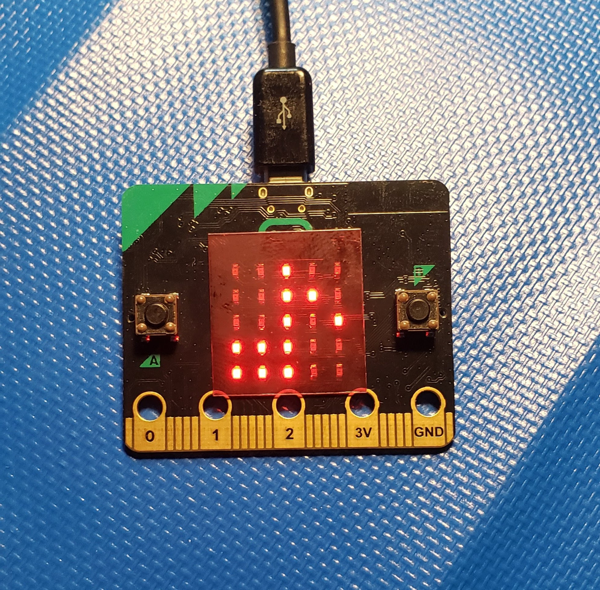

# CPE 1040 - Fall 2020
```
  _           _       _   _       _       _                 _    
 | |         | |     | \ | |     | |     | |               | |   
 | |     __ _| |__   |  \| | ___ | |_ ___| |__   ___   ___ | | __
 | |    / _` | '_ \  | . ` |/ _ \| __/ _ \ '_ \ / _ \ / _ \| |/ /
 | |___| (_| | |_) | | |\  | (_) | ||  __/ |_) | (_) | (_) |   < 
 |______\__,_|_.__/  |_| \_|\___/ \__\___|_.__/ \___/ \___/|_|\_\
                                                                                                                      
```
ASCII art acknowledgement: [taag](http://patorjk.com/software/taag/)

**Directions:** 
1. This [README](README.md) is _intentionally left_ blank, to be used as the _Lab Notebook_ for the learning progression & submission. _It is a great aid for your study and the main component of your submission._
2. Read and follow the [learning progression](learning-progression.md).
3. Refer to the [submission example](submission-example.md) for formatting expectations and examples. 
---

# Submission for Learning Progression 001

## Step 1

### 1.3.1

**Question 1.1.1:**

**Answer:** Lorem ipsum dolor sit amet, consectetur adipiscing elit, sed do eiusmod tempor incididunt ut labore et dolore magna aliqua. Ut enim ad minim veniam, quis nostrud exercitation ullamco laboris nisi ut aliquip ex ea commodo consequat. Duis aute irure dolor in reprehenderit in voluptate velit esse cillum dolore eu fugiat nulla pariatur. Excepteur sint occaecat cupidatat non proident, sunt in culpa qui officia deserunt mollit anim id est laborum.

_What is [lorem ipsum](https://www.lipsum.com/)?_


### 1.3.8



## Step 2

### 2.3.1

[Program 2.2.200](programs/microbit-program-2-2-200.js)

## Step 3

### 3.3.1

[Program 3.2.100](programs/microbit-program-3-2-100.js)

[Demo of program 3.2.100](https://msudenver.yuja.com/V/Video?v=1672915&node=5901978&a=760153473&autoplay=1)
